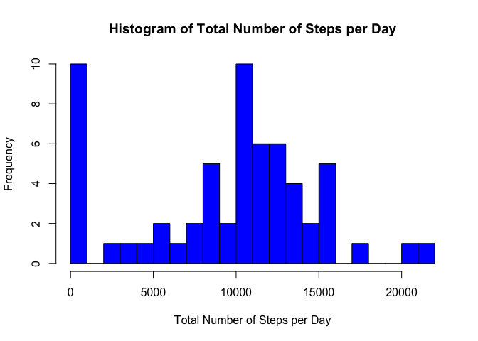
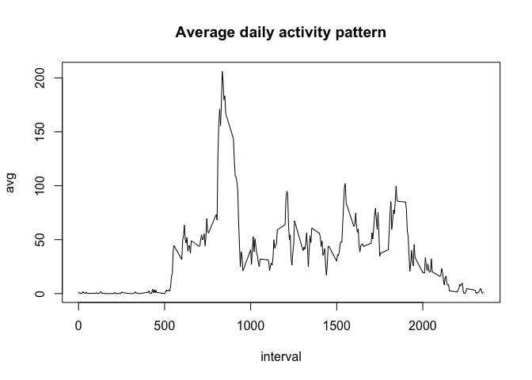
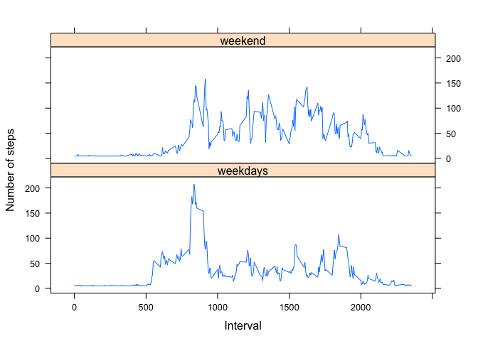

# Reproducible Research: Peer Assessment 1
First, we make sure that all code chunks are visible:


```r
library(knitr)
opts_chunk$set(echo=TRUE)
```

## Loading and preprocessing the data

1. Load the data (i.e. read.csv())


```r
if(!file.exists('activity.csv')){
    unzip('activity.zip')
}
activityData <- read.csv('activity.csv', header = T, sep = ",")
```

2. Process/transform the data (if necessary) into a format suitable for your analysis


```r
activityData$date <- as.Date(activityData$date)

str(activityData)
```

```
## 'data.frame':	17568 obs. of  3 variables:
##  $ steps   : int  NA NA NA NA NA NA NA NA NA NA ...
##  $ date    : Date, format: "2012-10-01" "2012-10-01" ...
##  $ interval: int  0 5 10 15 20 25 30 35 40 45 ...
```

## What is mean total number of steps taken per day?

1. Calculate the total number of steps taken per day

The total steps per day are summed up using the tapply function.


```r
activityDataSteps <- tapply(activityData$steps, activityData$date, sum, na.rm=T)
```

2. Histogram of the total number of steps taken each day


```r
library(reshape2)
activityDataMelt <- melt(activityDataSteps)
names(activityDataMelt) <- c("Date", "SumofSteps")
head(activityDataMelt)
```

```
##         Date SumofSteps
## 1 2012-10-01          0
## 2 2012-10-02        126
## 3 2012-10-03      11352
## 4 2012-10-04      12116
## 5 2012-10-05      13294
## 6 2012-10-06      15420
```

```r
hist(activityDataMelt$SumofSteps, main = "Histogram of Total Number of Steps per Day", 
    xlab = "Total Number of Steps per Day", ylab = "Frequency", col = "blue", 
    breaks = 30)
```

<!-- -->

3. Calculate and report the mean and median of the total number of steps taken per day

The mean


```r
step_mean <- mean(activityDataMelt$SumofSteps, na.rm = T)
step_mean
```

```
## [1] 9354.23
```

The median


```r
step_median <- median(activityDataMelt$SumofSteps, na.rm = T)
step_median
```

```
## [1] 10395
```

## What is the average daily activity pattern?

1. A time series plot (i.e. 𝚝𝚢𝚙𝚎 = "𝚕") of the 5-minute interval (x-axis) and the average number of steps taken, averaged across all days (y-axis)


```r
activityDataAvg <- tapply(activityData$steps, activityData$interval, mean, na.rm = T)
activityDataMeltAvg <- melt(activityDataAvg)
names(activityDataMeltAvg) <- c("interval", "avg")
nrow(activityDataMeltAvg)
```

```
## [1] 288
```


```r
plot(avg ~ interval, data = activityDataMeltAvg, type = "l", main = "Average daily activity pattern")
```

<!-- -->


2. The 5-minute interval, on average across all the days in the dataset, that contains the maximum number of steps


```r
activityDataMeltAvg[activityDataMeltAvg$avg == max(activityDataMeltAvg$avg), ]
```

```
##     interval      avg
## 104      835 206.1698
```


## Imputing missing values

1. The total number of missing values in the dataset (i.e. the total number of rows wih NAs)

```r
length(which(is.na(activityData$steps)))
```

```
## [1] 2304
```

2. Devise a strategy for filling in all of the missing values in the dataset. The strategy does not need to be sophisticated. For example, you could use the mean/median for that day, or the mean for that 5-minute interval, etc.


```r
mean(activityData$steps, na.rm = T)
```

```
## [1] 37.3826
```

3. Create a new dataset that is equal to the original dataset but with the missing data filled in.


```r
activityDataImpute <- activityData
activityDataImpute$steps[is.na(activityDataImpute$steps)] <- mean(activityDataImpute$steps, na.rm = T)
length(which(is.na(activityDataImpute)))
```

```
## [1] 0
```

4. Make a histogram of the total number of steps taken each day and Calculate and report the mean and median total number of steps taken per day. Do these values differ from the estimates from the first part of the assignment? What is the impact of imputing missing data on the estimates of the total daily number of steps?

``{r}
activityDataImputeSteps <- tapply(activityDataImpute$steps, activityDataImpute$date, sum)

library(reshape2)
activityDataMeltImpute <- melt(activityDataImputeSteps)
names(activityDataMeltImpute) <- c("Date", "SumofSteps")
head(activityDataMeltImpute)

hist(activityDataMeltImpute$SumofSteps, main = "Histogram of Total Number of Steps per Day on  Impute Value", 
    xlab = "Total Number of Steps per Day", ylab = "Frequency", col = "blue", 
    breaks = 30)

mean(activityDataMeltImpute$SumofSteps, na.rm = T)

median(activityDataMeltImpute$SumofSteps, na.rm = T)
```

## Are there differences in activity patterns between weekdays and weekends?

1. Create a new factor variable in the dataset with two levels – “weekday” and “weekend” indicating whether a given date is a weekday or weekend day.


```r
activityDataImpute$weekdays <- weekdays(activityDataImpute$date)
activityDataImpute$weeks[(activityDataImpute$weekdays == "Saturday" | activityDataImpute$weekdays == "Sunday")] <-"weekend"

activityDataImpute$weeks[!(activityDataImpute$weekdays == "Saturday" | activityDataImpute$weekdays == "Sunday")] <-"weekdays"
```


```r
library(plyr)
week_comp <- ddply(activityDataImpute, c("interval", "weeks"), function(x) apply(x[1], 
    2, mean))
head(week_comp)
```

```
##   interval    weeks    steps
## 1        0 weekdays 7.006569
## 2        0  weekend 4.672825
## 3        5 weekdays 5.384347
## 4        5  weekend 4.672825
## 5       10 weekdays 5.139902
## 6       10  weekend 4.672825
```

2. Make a panel plot containing a time series plot (i.e. 𝚝𝚢𝚙𝚎 = "𝚕") of the 5-minute interval (x-axis) and the average number of steps taken, averaged across all weekday days or weekend days (y-axis). See the README file in the GitHub repository to see an example of what this plot should look like using simulated data.


```r
library(lattice)
xyplot(steps ~ interval | weeks, data = week_comp, type = "l", xlab = "Interval", 
    ylab = "Number of steps", layout = c(1, 2))
```

<!-- -->
